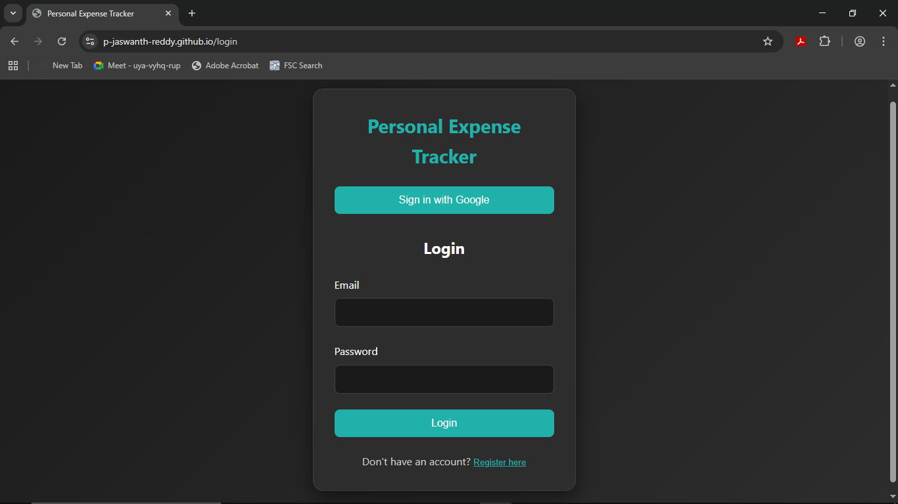
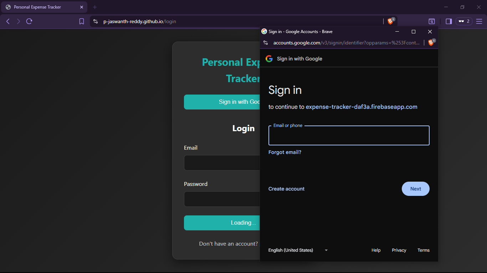

# Personal Expense Tracker using ReactJS

## Language Composition
- **JavaScript (React)**: The primary programming language used for developing the application.
- **CSS**: For styling the components and improving the user experience.
- **HTML**: The structure of the web application.

## Project Overview
This project is a Personal Expense Tracker built using ReactJS. It allows users to keep track of their daily expenses, categorize them, and visualize their spending habits over time. The application features a user-friendly interface and a robust backend for storing and managing expenses.

## Access Links
- **GitHub Repository**: [Link to Repository](https://github.com/P-Jaswanth-Reddy/personal-expense-tracker-using-reactjs)
- **Live Demo**: [Live Demo Link](https://p-jaswanth-reddy.github.io/personal-expense-tracker-using-reactjs/) 

## Screenshots

Login page  

Dashboard overview  

Categories page  

Google Sign-in popup  

## Features
- Add, edit, and delete expenses.
- Categorize expenses.
- Visual representation of spending (charts, graphs).
- User authentication .

## Installation
1. Clone the repository.
2. Navigate to the project directory.
3. Run `npm install` to install dependencies.
4. Run `npm start` to start the development server.

## Contributing
Contributions are welcome! Please open an issue or submit a pull request if you'd like to contribute to this project.
